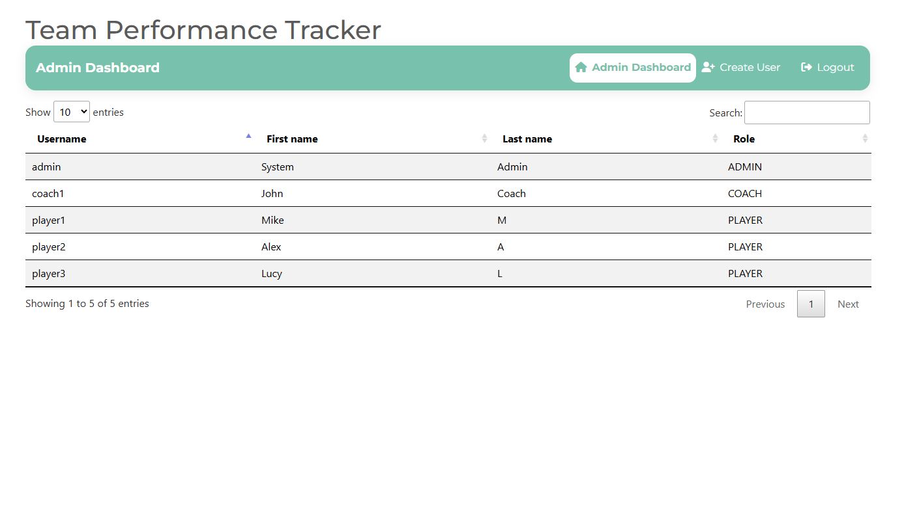
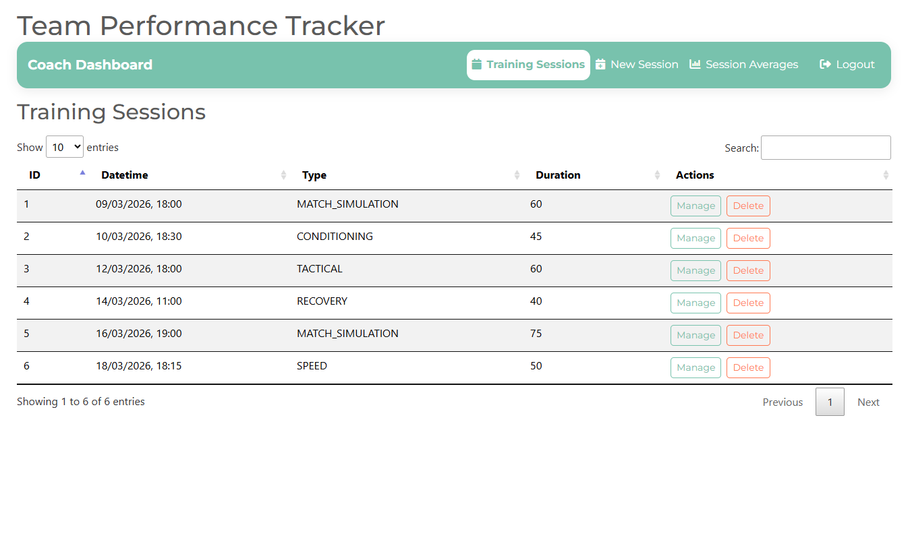
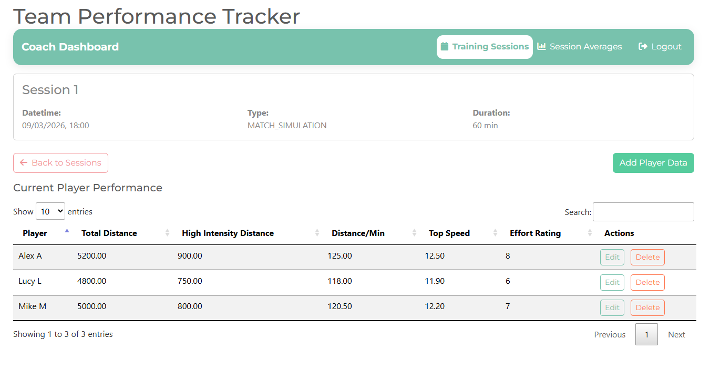
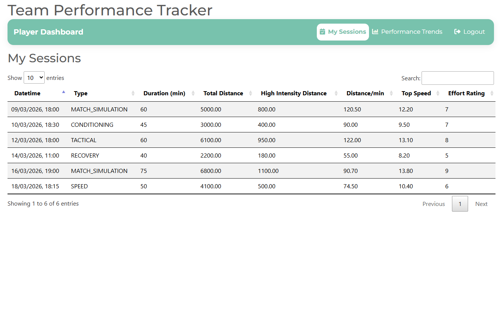
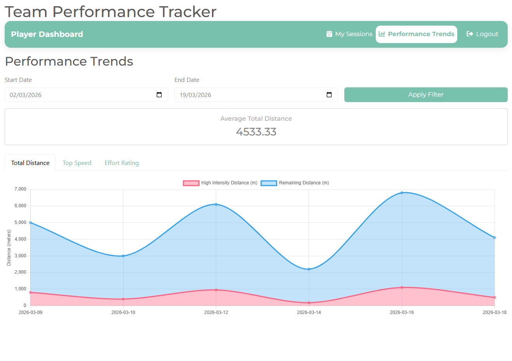

# ⚽ TeamPerformanceTracker

A web-based application for managing football training sessions and player performance data. Built with role-based access for Admins, Coaches, and Players to streamline session management, performance uploads, and data-driven analysis.

---

## Table of Contents

- [Features](#features)
- [Tech Stack](#tech-stack)
- [Getting Started](#getting-started)
- [Configuration](#configuration)
- [Database](#database)
- [Seed Data](#seed-data)
- [Running Tests](#running-tests)

---

## Features

### 👤 User Management
- Admins can create users and assign roles (Admin, Coach, Player)



### 📋 Training Sessions
- Coaches can create, update, and delete training sessions
- Sessions include type, date, and duration
- Coaches can upload, update, and delete player performance data per session





### 📊 Player Performance
- Upload and track performance metrics per session
- Visualise trends and charts over time





---

## Tech Stack

| Layer | Technologies |
|---|---|
| **Backend** | Java 21, Spring Boot, Spring Data JPA, Maven |
| **Database** | MySQL |
| **Frontend** | HTML, CSS, JavaScript, jQuery, Bootstrap |
| **Testing** | JUnit, Mockito, Karate (API), Selenium (UI) |
| **CI/CD** | Jenkins |

---

## Getting Started

### Prerequisites

- Java 21
- Maven
- MySQL (running locally)

### Installation
```bash
git clone https://github.com/NicholasHamm/TeamPerformanceTracker
cd TeamPerformanceTracker
mvn clean package
mvn spring-boot:run
```

Alternatively, import the project into **IntelliJ IDEA** or **Eclipse** and run it as a Spring Boot Application.

The application will be available at: **http://localhost:8082**

---

## Configuration

Application settings are managed via `src/main/resources/application.properties`. Update the MySQL connection details if needed:
```properties
spring.datasource.url=jdbc:mysql://localhost:3306/tptdb
spring.datasource.username=your_username
spring.datasource.password=your_password
```

---

## Database

On startup, the application will automatically create a MySQL schema named **`tptdb`** with the following tables:

- `users`
- `training_sessions`
- `player_performance`

> Ensure MySQL is running before starting the application.

---

## Seed Data

The following default users are seeded on first run:

| Role | Username | Password |
|---|---|---|
| Admin | `admin` | `admin` |
| Coach | `coach1` | `coach1` |
| Player | `player1` | `player1` |

---

## Running Tests

### Unit Tests
```bash
mvn test
```

### All Integration/UI Tests
```bash
mvn verify
```

### API Tests (Karate)
```bash
mvn -Papi-tests verify
```

### UI Tests (Selenium)
```bash
mvn -Pui-tests verify
```

---

## Project Context

This project was developed as part of a **Cross-Modular Assessment** spanning Web Technologies and Continuous Build & Delivery modules.